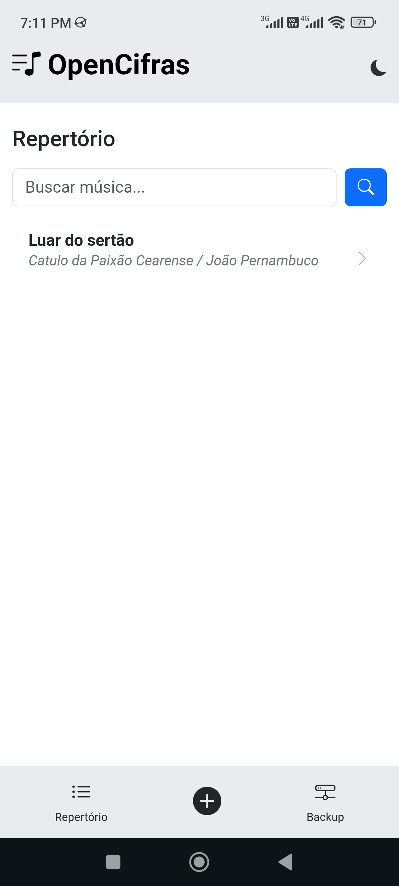
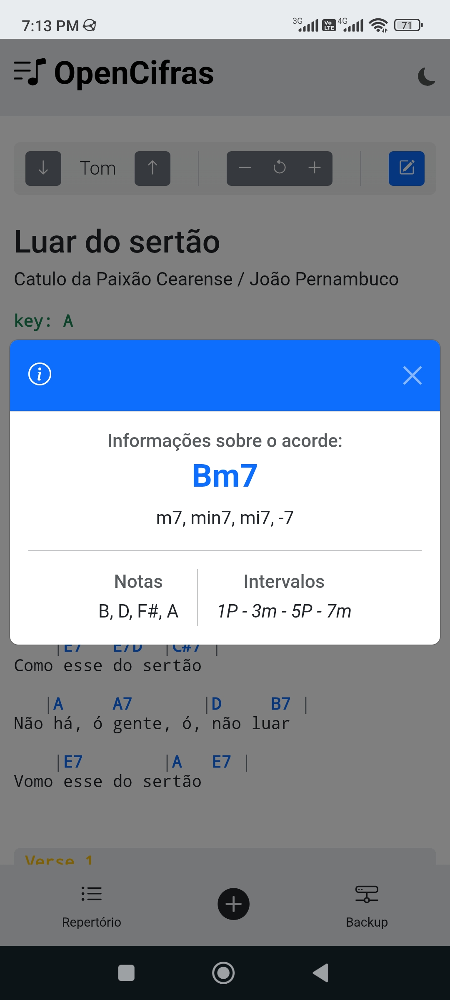
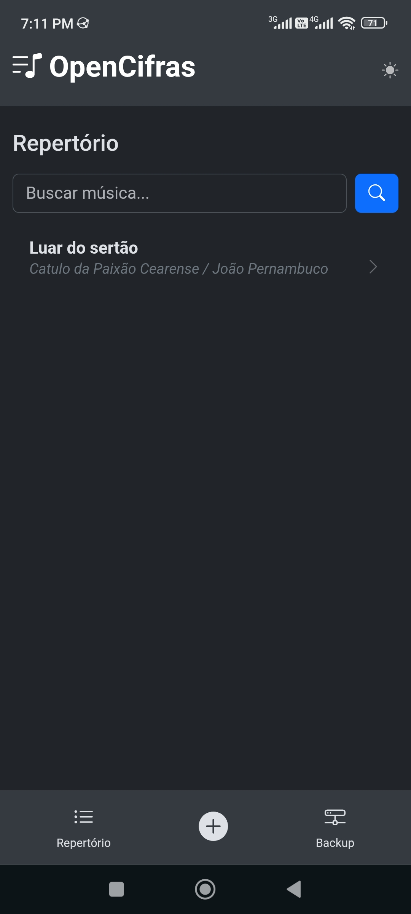
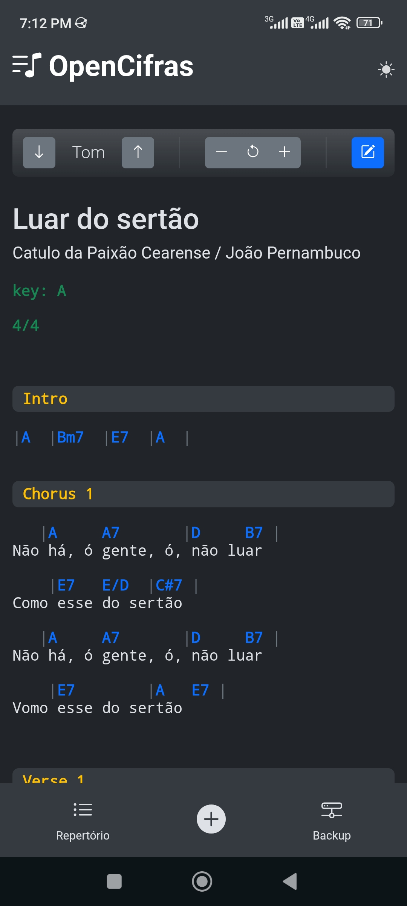
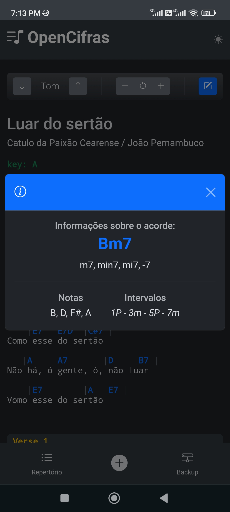
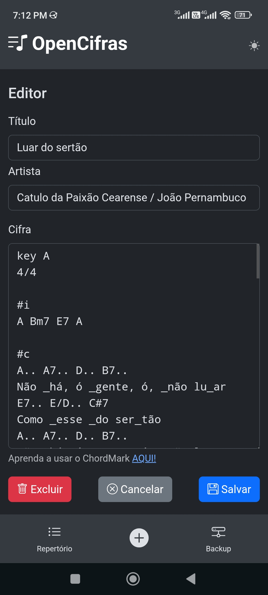

# [OpenCifras](https://realsigmamusic.github.io/OpenCifras/)

**OpenCifras** é uma Aplicação Web Progressiva (PWA) de código aberto desenvolvida para músicos e estudantes. O projeto oferece uma ferramenta minimalista, leve e funcional para criar, organizar e visualizar cifras e letras de músicas, operando totalmente offline.

O sistema utiliza o formato **ChordMark** para renderização, garantindo transposição automática de tons e formatação inteligente sem a necessidade de ajustes manuais de espaçamento.

## Visão Geral

O foco do projeto é a simplicidade e a privacidade. Não há rastreamento de usuários, contas ou dependência de servidores remotos para armazenar os dados. Tudo é processado e salvo localmente no dispositivo.

### Galeria

<table>
  <tr>
    <td align="center" width="25%">
      <strong>Repertório</strong><br>
      
    </td>
    <td align="center" width="25%">
      <strong>Visualização</strong><br>
      
    </td>
    <td align="center" width="25%">
      <strong>Informações</strong><br>
      
    </td>
    <td align="center" width="25%">
      <strong>Edição</strong><br>
      
    </td>
  </tr>
  <tr>
    <td align="center" width="25%">
      
    </td>
    <td align="center" width="25%">
      
    </td>
    <td align="center" width="25%">
      
    </td>
    <td align="center" width="25%">
      
    </td>
  </tr>
</table>

## Funcionalidades

### Gestão e Produtividade
* **Funcionamento Offline:** Graças à tecnologia PWA e IndexedDB, o acesso ao repertório independe de conexão com a internet.
* **CRUD Completo:** Criação, leitura, edição e exclusão de músicas de forma intuitiva.
* **Busca Instantânea:** Filtragem em tempo real por título, artista ou conteúdo da letra.
* **Backup e Restauração:** Exportação completa do banco de dados para arquivo JSON, permitindo migração entre dispositivos.

### Ferramentas Musicais
* **Renderização Dinâmica:** Formatação automática de cifras sobre as letras utilizando a biblioteca ChordMark.
* **Transposição de Tom:** Alteração de tonalidade em tempo real com recálculo automático da harmonia.
* **Metadados:** Organização por Artista e Título.

### Interface e Acessibilidade
* **Temas:** Suporte nativo a Modo Claro e Modo Escuro.
* **Responsividade:** Layout adaptável para dispositivos móveis (Android/iOS) e Desktops.
* **Zoom:** Controle de tamanho da fonte para melhor legibilidade durante a execução.

## Tecnologias

O projeto adota uma abordagem "Vanilla", evitando frameworks pesados e processos de build complexos, o que facilita a manutenção e o estudo do código.

* **Core:** HTML5, CSS3 e JavaScript (ES6 Modules).
* **Armazenamento:** Dexie.js (Wrapper para IndexedDB).
* **Renderização:** ChordMark (Parser de cifras).
* **Interface:** Bootstrap 5.3 (Grid system, componentes e utilitários).
* **Ícones:** Bootstrap Icons.

## Como Executar

### Pré-requisitos
Não é necessário instalar Node.js, PHP ou Python para o funcionamento básico, pois é uma aplicação *client-side* estática.

### Passos
1. Clone este repositório:
```bash
git clone https://github.com/realsigmamusic/OpenCifras.git
```
2. Acesse a pasta do projeto.
3. Sirva os arquivos através de um servidor HTTP local.
**Por que um servidor local?**
Devido às políticas de segurança dos navegadores (CORS), os *Service Workers* e *ES6 Modules* não funcionam corretamente se abertos diretamente via protocolo de arquivo (`file://`).
Exemplos de como subir um servidor simples:
    * **Python:** `python -m http.server`
    * **VS Code:** Extensão "Live Server".
    * **Node (http-server):** `npx http-server .`
4. Acesse `http://localhost:8000` (ou a porta indicada pelo seu servidor).

## Hospedagem (Deploy)

Sendo uma aplicação estática, o OpenCifras pode ser hospedado gratuitamente em serviços como:

* GitHub Pages
* Vercel
* Netlify
* Cloudflare Pages

## Estrutura do Projeto

* `index.html`: Ponto de entrada e estrutura DOM principal.
* `sw.js`: Service Worker para cacheamento de ativos e suporte offline.
* `manifest.json`: Definições de instalação PWA.
* `js/`: Lógica da aplicação modularizada.
* `app.js`: Controlador principal e roteamento.
* `db.js`: Camada de persistência de dados.
* `render.js`: Integração com o renderizador de cifras.
* `ui.js`: Manipulação de eventos e interface.
* `backup.js`: Rotinas de importação/exportação.


## Licença e Créditos

Este projeto é distribuído sob a licença **MIT**. Veja o arquivo `LICENSE` para detalhes.

**Créditos de Terceiros:**

* Ícones criados por Nikita Golubev (Flaticon).
* Ícones adaptados via Maskable.app.